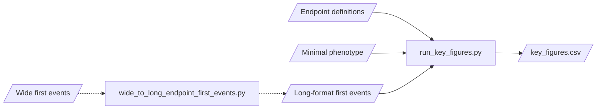
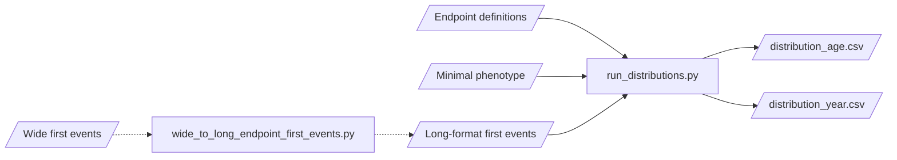
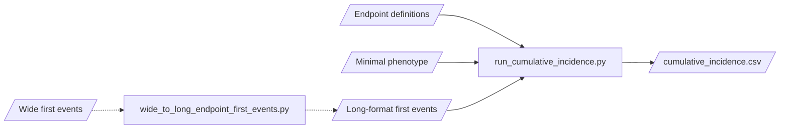
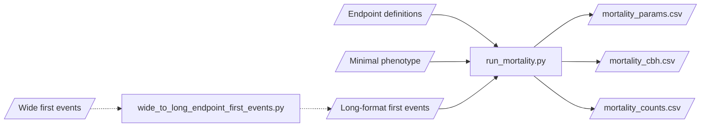
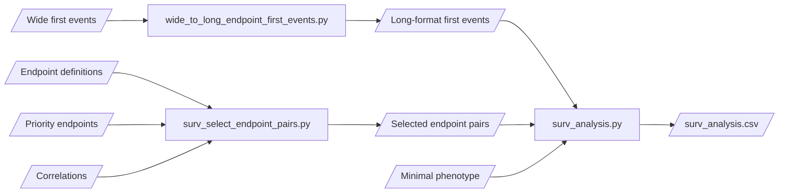
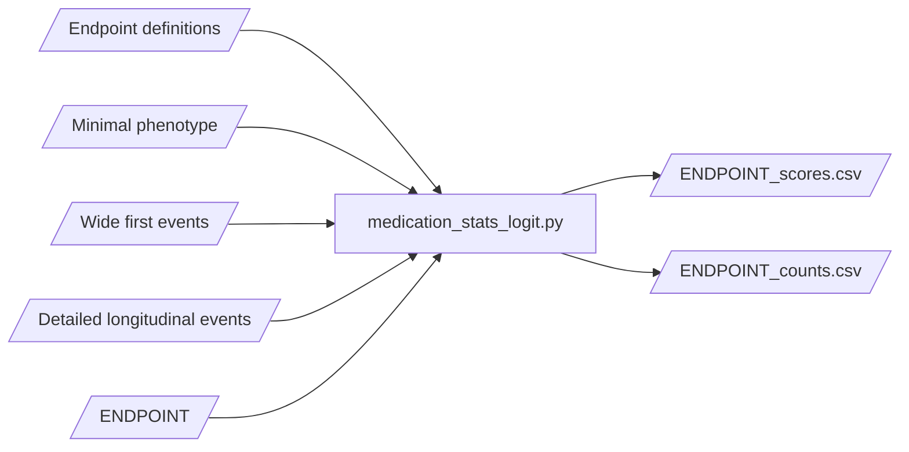

# Risteys Pipeline

The Risteys pipeline is used for generating aggregated data displayed on the [Risteys portal](https://risteys.finregistry.fi/). The aggregated data covers the following:
- Key figures (number of persons, period prevalence, median age)
- Age and year distributions
- Cumulative incidence function
- Mortality analysis

The methods are described in [Risteys documentation](https://risteys.finregistry.fi/documentation). If you have any questions or feedback, feel free to [contact us](https://airtable.com/shrTzTwby7JhFEqi6) or [open an issue](https://github.com/dsgelab/risteys/issues/new) on GitHub.

## Getting started

### Requirements

- Conda
- Requirements listed in `requirements.txt`

### Setup

The required python packages can be installed using `conda` as follows:

```
conda create --name <env_name> --file requirements.txt
```

The `risteys_pipeline` module can be installed from the project root (`pipeline`) as follows:

```
conda activate <env_name>
cd pipeline
python setup.py install
```

### Running tests

Tests can be ran from the project root (`pipeline`) as follows.

```
pytest test
```

If you want to suppress deprecation warnings, use the following for running the tests.

```
pytest test -W ignore::DeprecationWarning
```

## Usage

1. Make sure all the file paths in `config.py` match the location of the source data files.

2. Move to the `pipeline` directory.
```
cd <project_root>/pipeline
```

3. Run a script.
```
python risteys_pipeline/<file_name>
# e.g. python risteys_pipeline/run_mortality.py
```

The Risteys pipeline is organized as a Python module. You may use parts of the pipeline by importing the functions.
```python
from risteys_pipeline.sample import calculate_sampling_weight
```


Note that the Cox HR computations are not run part of the pipeline.
Instead, they are run with [dsub](https://github.com/DataBiosphere/dsub).
Check the documentation in `surv_analysis.py` for more information.

## Source data

| Dataset | File | Source | Notes |
| ------- | ---- | ------ | ----- |
| Endpoint definitions | `+Endpoints_Controls_FINNGEN_ENDPOINTS_DF?_Final_?_corrected.xlsx+` | Clinical team |
| Minimal phenotype | `+finngen_R?_minimum_?.txt.gz+` | e-Science team |
| Wide first events | `+finngen_R?_endpoint_?.txt.gz+` | e-Science team | Used to generate the long-format first events dataset using `wide_to_long_endpoint_first_events.py`
| Detailed longitudinal events | `+finngen_R?_detailed_longitudinal_?.txt.gz+` | e-Science team | FinnGen only
| Filter of individuals | `R?_COV_PHENO_V?.txt.gz` | Analysis team, e-Science team | FinnGen only
| Endpoint priority list | FinnGen priority phenotypes (sheet: priority) (Google Sheet) | Clinical team | FinnGen only. Extract the `Code` column to a file.
| Endpoint info columns | - | - | FinnGen only. Includes columns `FINNGENID`, `FU_END_AGE` and `SEX` extracted from the wide first-events file

All files need to be formatted to CSV or feather for processing in the Risteys pipeline. The `?` in file names denotes a placeholder for versioning information.

## Data flow

#### Endpoint ontology (FinnGen only)

TBD

#### Key figures



#### Age and year distributions



#### Cumulative incidence function



#### Mortality analysis



#### Endpoint-endpoint survival analysis (FinnGen only)



#### Medication stats (FinnGen only)


